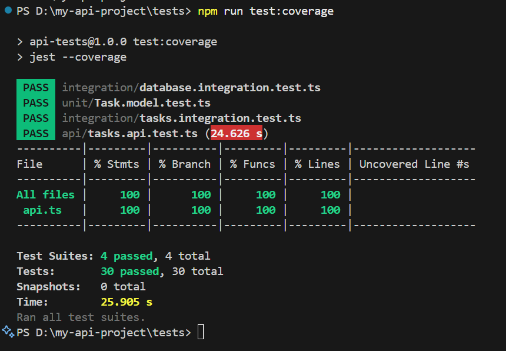

# Task Manager API (Next.js + TypeScript + MongoDB)

A full-stack task management application with custom REST APIs, MongoDB database integration, and a React frontend.

## Tech Stack
- **Next.js** (API routes & frontend framework)
- **React** (UI library)
- **TypeScript** (type safety)
- **MongoDB** (database)
- **Mongoose** (MongoDB ODM)
- **Tailwind CSS** (utility-first CSS framework)
- **Node.js** (runtime)
- **npm** (package manager)

## Prerequisites
- Node.js (version 14 or higher)
- npm or yarn
- MongoDB database (local or cloud)

## Quick Start

### 1. Clone and Install
```bash
git clone https://github.com/ramankumar7c/my-api-project.git
cd my-api-project
npm install
```

### 2. Set up MongoDB

#### Option A: MongoDB Atlas (Recommended for beginners)
1. Go to [MongoDB Atlas](https://www.mongodb.com/atlas)
2. Create a free account and cluster
3. Get your connection string
4. Replace `<username>`, `<password>`, and `<cluster>` with your actual values

#### Option B: Local MongoDB
1. Install MongoDB locally
2. Start MongoDB service
3. Use connection string: `mongodb://localhost:27017/task-manager`

### 3. Environment Configuration
Create a `.env.local` file in the root directory:
```
MONGODB_URI=your_mongodb_connection_string_here
```

### 4. Run the Application
```bash
npm run dev
```

Visit `http://localhost:3000` to see the application.

## Troubleshooting

### Common Issues

1. **MongoDB Connection Error**
   - Check your connection string
   - Ensure MongoDB is running
   - Verify network access (for Atlas)

2. **Port Already in Use**
   - Change port: `npm run dev -- -p 3001`
   - Or kill the process using port 3000

3. **Module Not Found Errors**
   - Run `npm install` again
   - Clear node_modules and reinstall

### Getting Help
- Check the console for error messages
- Verify your MongoDB connection string
- Ensure all dependencies are installed

## Features
- **Custom API** with 5 CRUD endpoints
- **MongoDB + Mongoose** integration for data persistence
- **React Frontend** with complete CRUD operations
- **TypeScript** for type safety
- **Tailwind CSS** for styling
- **AI-powered API testing with Keploy**

## API Documentation

### Base URL
```
http://localhost:3000/api
```

### Endpoints

#### 1. Get All Tasks
**GET** `/api/tasks`

Returns a list of all tasks.

**Response:**
```json
[
  {
    "_id": "64f8a1b2c3d4e5f6a7b8c9d0",
    "title": "Complete project documentation",
    "completed": false,
    "createdAt": "2023-09-06T10:30:00.000Z",
    "updatedAt": "2023-09-06T10:30:00.000Z"
  }
]
```

#### 2. Create New Task
**POST** `/api/tasks`

Creates a new task.

**Request Body:**
```json
{
  "title": "New task title",
  "completed": false
}
```

**Response:**
```json
{
  "_id": "64f8a1b2c3d4e5f6a7b8c9d0",
  "title": "New task title",
  "completed": false,
  "createdAt": "2023-09-06T10:30:00.000Z",
  "updatedAt": "2023-09-06T10:30:00.000Z"
}
```

#### 3. Get Task by ID
**GET** `/api/tasks/:id`

Returns a specific task by its ID.

**Response:**
```json
{
  "_id": "64f8a1b2c3d4e5f6a7b8c9d0",
  "title": "Complete project documentation",
  "completed": false,
  "createdAt": "2023-09-06T10:30:00.000Z",
  "updatedAt": "2023-09-06T10:30:00.000Z"
}
```

#### 4. Update Task
**PUT** `/api/tasks/:id`

Updates an existing task.

**Request Body:**
```json
{
  "title": "Updated task title",
  "completed": true
}
```

**Response:**
```json
{
  "_id": "64f8a1b2c3d4e5f6a7b8c9d0",
  "title": "Updated task title",
  "completed": true,
  "createdAt": "2023-09-06T10:30:00.000Z",
  "updatedAt": "2023-09-06T11:45:00.000Z"
}
```

#### 5. Delete Task
**DELETE** `/api/tasks/:id`

Deletes a task by its ID.

**Response:** `204 No Content`

## Testing Your API

### Automated Testing
Run the included test script to verify all API endpoints:
```bash
npm run test-api
```

### Manual Testing with Postman

#### Step 1: Download Postman
1. Go to [postman.com](https://www.postman.com/downloads/)
2. Download and install Postman
3. Create a free account

#### Step 2: Test Each Endpoint Manually

**1. Get All Tasks (GET)**
- Method: `GET`
- URL: `http://localhost:3000/api/tasks`
- Click "Send"
- Expected: Array of tasks (empty initially)

**2. Create Task (POST)**
- Method: `POST`
- URL: `http://localhost:3000/api/tasks`
- Headers: `Content-Type: application/json`
- Body (raw JSON):
```json
{
  "title": "My first task",
  "completed": false
}
```
- Click "Send"
- Expected: Created task with `_id`
- **Copy the `_id` from response for next tests**

**3. Get Task by ID (GET)**
- Method: `GET`
- URL: `http://localhost:3000/api/tasks/YOUR_TASK_ID_HERE`
- Click "Send"
- Expected: Single task object

**4. Update Task (PUT)**
- Method: `PUT`
- URL: `http://localhost:3000/api/tasks/YOUR_TASK_ID_HERE`
- Headers: `Content-Type: application/json`
- Body (raw JSON):
```json
{
  "title": "Updated task title",
  "completed": true
}
```
- Click "Send"
- Expected: Updated task object

**5. Delete Task (DELETE)**
- Method: `DELETE`
- URL: `http://localhost:3000/api/tasks/YOUR_TASK_ID_HERE`
- Click "Send"
- Expected: 204 No Content

**6. Test Error Handling**
- Method: `GET`
- URL: `http://localhost:3000/api/tasks/invalid-id`
- Click "Send"
- Expected: 400 Bad Request with error message

### Using curl

1. **Get all tasks:**
```bash
curl http://localhost:3000/api/tasks
```

2. **Create a new task:**
```bash
curl -X POST http://localhost:3000/api/tasks \
  -H "Content-Type: application/json" \
  -d '{"title": "Test task", "completed": false}'
```

3. **Get a specific task:**
```bash
curl http://localhost:3000/api/tasks/TASK_ID_HERE
```

4. **Update a task:**
```bash
curl -X PUT http://localhost:3000/api/tasks/TASK_ID_HERE \
  -H "Content-Type: application/json" \
  -d '{"title": "Updated task", "completed": true}'
```

5. **Delete a task:**
```bash
curl -X DELETE http://localhost:3000/api/tasks/TASK_ID_HERE
```

## Frontend Features

The React frontend provides:
- ✅ **Create** new tasks
- ✅ **Read** all tasks
- ✅ **Update** task completion status
- ✅ **Delete** tasks
- Real-time updates after operations
- Responsive design with Tailwind CSS

## Database Schema

```typescript
interface Task {
  _id: string;
  title: string;
  completed: boolean;
  createdAt: Date;
  updatedAt: Date;
}
```

## Error Handling

The API returns appropriate HTTP status codes:
- `200` - Success
- `201` - Created
- `204` - No Content (for DELETE)
- `400` - Bad Request
- `404` - Not Found
- `405` - Method Not Allowed
- `500` - Internal Server Error

## Project Structure

```
my-api-project/
├── lib/
│   └── dbConnect.ts          # MongoDB connection
├── models/
│   └── Task.ts              # Task model schema
├── pages/
│   ├── api/
│   │   └── tasks/
│   │       ├── index.ts     # GET all, POST new
│   │       └── [id].ts      # GET, PUT, DELETE by ID
│   │       └── index.tsx    # Frontend
├── styles/
│   └── globals.css          # Global styles
├── test-api.js              # API testing script
└── README.md                # This file
```

## Contributing

1. Fork the repository
2. Create a feature branch
3. Make your changes
4. Test thoroughly
5. Submit a pull request

## License

This project is open source and available under the [MIT License](LICENSE).

---

**Author:** [Raman Kumar]  
**GitHub:** [https://github.com/ramankumar7c](https://github.com/ramankumar7c)

## API Testing with Keploy

This project integrates **Keploy AI API Testing** for intelligent API testing in the CI/CD pipeline.

### Setup Instructions

1. **Create Keploy Account**
   - Go to [app.keploy.io](https://app.keploy.io)
   - Sign up and create a new account

2. **Create Test Suite**
   - Navigate to "Test Suite" in the sidebar
   - Create a new test suite for your API
   - Copy your App ID from the dashboard

3. **Configure GitHub Secrets**
   - Go to your repository → Settings → Security → Actions
   - Add new repository secret: `KEPLOY_API_KEY`
   - Get your API key from the Keploy dashboard

4. **Update CI/CD Configuration**
   - Replace `your-app-id` in `.github/workflows/ci-cd.yml` with your actual App ID
   - The base path should be: `http://localhost:3000/api`

### Current Configuration

```yaml
- name: Run Keploy Test Suite
  run: |
    export KEPLOY_API_KEY=${{ secrets.KEPLOY_API_KEY }}
    export KEPLOY_APP_ID=${{ secrets.KEPLOY_APP_ID }}
    export KEPLOY_BASE_PATH=${{ secrets.KEPLOY_BASE_PATH }}
    keploy test-suite --app=$KEPLOY_APP_ID --base-path $KEPLOY_BASE_PATH --cloud
```

**⚠️ Required GitHub Secrets:**
- `KEPLOY_API_KEY`: Your Keploy API key
- `KEPLOY_APP_ID`: Your Keploy App ID (e.g., 10785d1f-5ea9-41e0-b896-699a35b4a143)
- `KEPLOY_BASE_PATH`: Your API base URL (e.g., https://my-api-project-nu.vercel.app/api)

### Test Reports

- **Dashboard**: View detailed test reports at [app.keploy.io](https://app.keploy.io)
- **CI/CD**: Test results are displayed in GitHub Actions logs
- **Real-time**: Tests run in the cloud with AI-powered analysis

## API Endpoints

- `GET /api/tasks` - Get all tasks
- `POST /api/tasks` - Create a new task
- `GET /api/tasks/[id]` - Get a specific task
- `PUT /api/tasks/[id]` - Update a task
- `DELETE /api/tasks/[id]` - Delete a task

## Development

```bash
# Install dependencies
npm install

# Run development server
npm run dev

# Run tests
npm test

# Build for production
npm run build
```

## CI/CD Pipeline

The project includes a comprehensive CI/CD pipeline with:

1. **Linting & Build** - Code quality checks and build process
2. **Unit Tests** - Jest-based unit testing with coverage
3. **API Testing** - Keploy AI-powered API testing
4. **Test Summary** - Comprehensive test results summary

## Technologies Used

- **Framework**: Next.js 14
- **Database**: MongoDB with Mongoose
- **Testing**: Jest, Supertest
- **API Testing**: Keploy AI
- **CI/CD**: GitHub Actions
- **Documentation**: OpenAPI 3.0

## Screenshots

### Keploy Test Dashboard


*Note: Replace with actual Keploy dashboard screenshot once configured*
